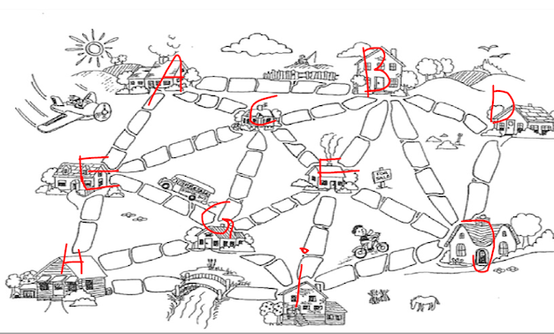
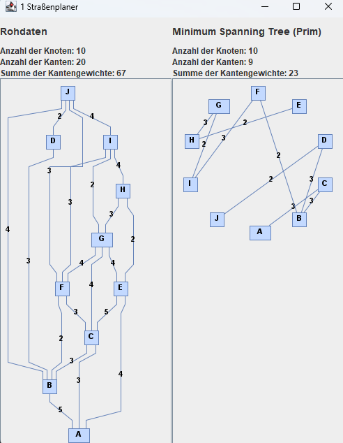

# Problem 1 - "Straßen müssen her!"

Lange Zeit gab es in der Graphschaft Schilda einen Reformstau, kein Geld floss mehr in die Infrastruktur. Wie es kommen musste, wurde der Zustand der Stadt zusehends schlechter, bis die Bürger der Graphschaft den Aufbau Ihrer Stadt nun endlich selbst in die Hand nahmen. Zunächst einmal sollen neue Straßen gebaut werden. Zur Zeit gibt es nur einige schlammige Wege zwischen den Häusern. Diese sollen nun gepflastert werden, so dass von jedem Haus jedes andere Haus erreichbar ist. 

Da die Bürger der Stadt arm sind, soll der Straßenbau insgesamt möglichst wenig kosten. Die Bürger haben bereits einen Plan mit möglichen Wegen erstellt. Ihre Aufgabe ist nun, das kostengünstigste Wegenetz zu berechnen, so dass alle Häuser miteinander verbunden sind (nehmen Sie dabei pro Pflasterstein Kosten von 1 an):

## Modellierung des Problems

Das Problem lässt sich als Graphenmodell mit ungerichteten Kanten darstellen. Jedes Haus ist ein Knoten, die Straßen sind die Kanten. Die Kosten der Kanten sind die Kosten für die Pflastersteine. 

Es wird eine Konfiguration an Kanten gesucht, die eine minimale Anzahl an Pflastersteinen benötigt.

Um den Graph zu modellieren werden die Java-Bibliotheken `JGraphT` und `JGraphX` verwendet. Mit `JGraphT` wird der Graph als Datenstruktur modelliert. Mit `JGraphX` wird der Graph als Grafik dargestellt und auf dem Bildschirm dargestellt.

## Die Eingabe

Die Eingabe besteht aus einem Graphen, der aus Kanten und Knoten besteht. Diese werden aus einer `.txt` Datei gelesen und in eine Instanz der Klasse `AdjazenzMatrix.java` geladen. Diese Instanz dient als Basis für die Berechnung des minimalen Spannbaums.

Das Bild aus der Aufgabenstellung wurde mit Buchstaben von A bis J beschriftet und daraus wurde die Datei `problem1.txt` erstellt.




```js
// code/data/problem1.txt
  A B C D E F G H I J
A 0
B 5 0
C 3 3 0
D 0 3 0 0
E 4 0 5 0 0
F 0 2 3 0 0 0
G 0 0 4 0 4 4 0
H 0 0 0 0 2 0 3 0
I 0 0 0 0 0 3 2 4 0
J 0 4 0 2 0 3 0 0 4 0
```

## Die Ausgabe

Die Ausgabe wird als Graph in einem Fenster dargestellt und in die Datei `1 Straßenplaner.txt` geschrieben. Das Fenster besteht aus zwei Hälften. Auf der linken Seite wird der Eingabegraph dargestellt. Auf der rechten Seite wird der berechnete Graph dargestellt. 

Ein korrekte Ausgabe erfüllt folgende Eigenschaften:

- Die Summe der Kantengewichte muss minimal sein.

- Alle Knoten müssen über Kanten erreichbar sein.

- Der Graph muss zusammenhängend und zyklusfrei sein.

- Die Kanten müssen ungerichtet sein.

- Alle Knoten des Eingabe-Graphen müssen im Ausgabe-Graphen enthalten sein.



```js
// code/output/1 Straßenplaner.txt
  A B C D E F G H I J 
A 0 
B 0 0 
C 3 3 0 
D 0 3 0 0 
E 0 0 0 0 0 
F 0 2 0 0 0 0 
G 0 0 0 0 0 0 0 
H 0 0 0 0 2 0 3 0 
I 0 0 0 0 0 3 2 0 0 
J 0 0 0 2 0 0 0 0 0 0 
```

## Geeignete Algorithmen

Es gibt verschiedene Algorithmen, die verwendet werden können, um den minimalen Spannbaum eines ungerichteten Graphen zu berechnen. Einige dieser Algorithmen sind:

**Kruskal-Algorithmus**: Dieser Algorithmus sortiert alle Kanten des Graphen nach ihrem Gewicht und fügt sie dann eine nach der anderen dem minimalen Spannbaum hinzu, wobei sichergestellt wird, dass keine Schleife entsteht. Der Algorithmus endet, wenn alle Knoten des Graphen Teil des Spannbaums sind.

**Prim-Algorithmus**: Dieser Algorithmus beginnt mit einem beliebigen Knoten des Graphen und fügt nacheinander Kanten hinzu, die den aktuellen minimalen Spannbaum mit einem neuen Knoten verbinden. Der Algorithmus endet, wenn alle Knoten des Graphen Teil des Spannbaums sind.

**Borůvka-Algorithmus**: Dieser Algorithmus ist eine Variation des Kruskal-Algorithmus und wird häufig verwendet, wenn der Graph sehr groß ist. Der Algorithmus sortiert die Kanten des Graphen nicht nach ihrem Gewicht, sondern sucht in jedem Schritt nach der leichtesten Kante, die einen Knoten mit dem minimalen Spannbaum verbindet. Der Algorithmus endet, wenn alle Knoten des Graphen Teil des Spannbaums sind.

## Die Laufzeit des Algorithmus

Die Laufzeit der Funktion `prim()` hängt von der Anzahl der Knoten (V) und der Anzahl der Kanten (E) im Graph ab. 

Die Funktion `getEdges(matrix, vertexLetters)` hat eine Laufzeit von O(V^2), da sie eine Schleife über alle V^2 möglichen Kanten des Graphs durchführt. 

Die Funktion `getNeighbors(u, vertices, edges)` hat eine Laufzeit von O(V * E), da sie eine Schleife über alle V Vertices und eine Schleife über alle E Kanten durchführt, um alle Nachbarn von u zu finden.

Die while-Schleife hat eine Laufzeit von O(V), da alle Knoten in der Prioritätswarteschlange einmal durchlaufen werden können. Innerhalb der while-Schleife wird ein Element aus der Warteschlange genommen O(log(V)) und die Funktion `getNeighbors()` aufgerufen. 

Daraus resultiert eine Laufzeit von O(V^2) + O(V) * ( O(log(V) + O(V * E) ).
Umgeformt ergibt sich eine Laufzeit von O(V^2 + V^2 * E + V * log(V)).

Dies kann auf O(V^2 * E) vereinfacht werden.

## Die Implementierung des Algorithmus

Zur Lösung des Problems wurde der Algorithmus von Prim implementiert. Der Algorithmus von Prim ist ein Greedy-Algorithmus. Als Datenstruktur wurde eine Prioritätswarteschlange verwendet, die Instanzen der Klasse `Vertex` beinhaltet: 

Zuerst wird eine Liste aller Knoten und Kanten erstellt. Die Knoten werden mit dem maximalen Wert für Integer und ohne Vorgänger initialisiert. Anschließend wird ein beliebiger Knoten als Startknoten gewählt (In diesem Fall der Erste). Der Startknoten bekommt den Wert `0`. Alle Knoten werden in eine Prioritätswarteschlange `Q` eingefügt.

Danach wird eine while-Schleife verwendet um alle Knoten zu durchlaufen. In der Schleife wird der Knoten mit dem kleinsten Wert aus der Warteschlange `Q` entfernt. Anschließend wird für jeden Nachbarknoten des aktuellen Knotens überprüft, ob der Wert des Nachbarknotens größer als der Wert des aktuellen Knotens plus der Kosten der Kante ist. Wenn dies der Fall ist, wird der Wert des Nachbarknotens auf den Wert des aktuellen Knotens plus die Kosten der Kante gesetzt und der Vorgänger des Nachbarknotens auf den aktuellen Knoten gesetzt.

Am Ende wird die Liste aller Knoten in eine Adjazenzmatrix umgewandelt und zurückgegeben.


```java
private int[][] prim(int[][] matrix, char[] vertexLetters) {

  ArrayList<Vertex> vertices = new ArrayList<>();
  ArrayList<Edge> edges = getEdges(matrix, vertexLetters); // O(V^2)

  // Generiere eine Liste aller Knoten mit dem Wert unendlich und ohne Vorgänger
  for (int i = 0; i < matrix.length; i++)
    vertices.add(new Vertex(vertexLetters[i], Integer.MAX_VALUE, null));

  // Starte mit beliebigem Startknoten, Startknoten bekommt den Wert 0
  vertices.get(0).setKey(0);

  // Speichere alle Knoten in einer geeigneten Datenstruktur Q
  // -> Prioritätswarteschlange
  PriorityQueue<Vertex> q = new PriorityQueue<>(Comparator.comparingInt(Vertex::getKey));
  q.addAll(vertices);

  // Solange es noch Knoten in Q gibt...
  while (!q.isEmpty()) {
    // Entnehme den Knoten mit dem kleinsten Wert
    Vertex u = q.poll();

    // Für jeden Nachbarn n von u
    for (Vertex n : getNeighbors(u, vertices, edges)) { // O(V * E)
      // Finde die Kante (u, n)
      Edge e = null;
      for (Edge edge : edges)
        if ((edge.getSource() == u.getLetter() && edge.getTarget() == n.getLetter())
            || (edge.getSource() == n.getLetter() && edge.getTarget() == u.getLetter()))
          e = edge;

      // Wenn n in Q und das Gewicht der Kante (u, n) kleiner ist als der Wert von n
      if (!q.contains(n) || e.getWeight() >= n.getKey())
        continue;

      // Setze den Wert von n auf das Gewicht der Kante (u, n)
      n.setKey(e.getWeight());
      // Setze den Vorgänger von n auf u
      n.setPredecessor(u);
      // Aktualisiere die Position von n in Q
      q.remove(n);
      q.add(n);
    }
  }

  // Erstelle die Adjazenzmatrix für den Minimum Spanning Tree
  int[][] matrix_output = new int[matrix.length][matrix.length];
  for (Vertex v : vertices) {
    if (v.getPredecessor() == null)
      continue;

    int i = v.getLetter() - 'A';
    int j = v.getPredecessor().getLetter() - 'A';
    matrix_output[i][j] = matrix[i][j];
    matrix_output[j][i] = matrix[j][i];
  }
  return matrix_output;
}
```

