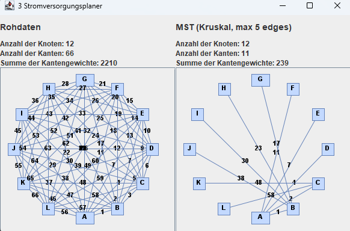

# Problem 3 - "Stromversorgung"

Die Stadt floriert, alles wird moderner und so muss auch die Stromversorgung erneuert werden. Die Stadt hat bereits eruiert, wo Strommasten aufgestellt werden können. Sie haben auch festgestellt, dass es keine Barrieren in der Stadt gibt, d.h., prinzipiell könnten alle Strommasten miteinander verbunden werden. Aber natürlich wollen wir lange Leitungen möglichst vermeiden. 

Deswegen schränken wir von vornherein ein, dass jeder Strommast nur mit maximal 5 nächsten Nachbarn verbunden werden darf.  Es stellt sich heraus, dass dies immer noch zu teuer ist. Deswegen soll dieses Netz noch einmal so reduziert werden, dass zwar alle Strommasten miteinander verbunden sind, aber Kosten insgesamt minimal sind. Wir nehmen dabei an, dass die Kosten ausschließlich von der Leitungslänge abhängen. 

## Modellierung des Problems

Das Problem lässt sich als Graphenmodell mit ungerichteten Kanten darstellen. Jeder Strommast ist ein Knoten, die Verbindungen sind die Kanten. Die Kosten der Kanten sind die Länge der Stromleitungen. 

Es wird eine Konfiguration an Leitungen zwischen den Strommasten gesucht, die eine minimale Gesamtlänge besitzt, und jeder Strommast mit maximal mit 5 weiteren Masten verbunden sein darf.

Um den Graph zu modellieren werden die Java-Bibliotheken `JGraphT` und `JGraphX` verwendet. Mit `JGraphT` wird der Graph als Datenstruktur modelliert. Mit `JGraphX` wird der Graph als Grafik dargestellt und auf dem Bildschirm dargestellt.

## Die Eingabe

Die Eingabe besteht aus Knoten, die aus einer `.json` Datei ausgelesen werden. 

``` json
{
  "directed_edges": false,
  "vertices": [
    { "label": "Pole 0" },
    { "label": "Pole 1" },
    { "label": "Pole 2" },
    ...
  ]
}
```

Mit der Funktion `generate_all_edges()` werden alle möglichen Kanten mit zufälligen Gewichten generiert. Diese werden dann dem Input hinzugefügt. 

``` java
private ArrayList<Edge> generate_all_edges(ArrayList<Vertex> vertices) {
  ArrayList<Edge> output = new ArrayList<Edge>();
  for (int i = 0; i < vertices.size(); i++) {
    for (int j = i + 1; j < vertices.size(); j++) {
      // generate random weight and add new edge to output
      output.add(new Edge(vertices.get(i).getLabel(),
          vertices.get(j).getLabel(), Math.round(Math.random() * 100.0)));
    }
  }
  return output;
}
```

## Die Ausgabe

Die Ausgabe wird als Graph in einem Fenster dargestellt. Das Fenster besteht aus zwei Hälften. Auf der linken Seite wird der Eingabegraph dargestellt. Auf der rechten Seite wird der berechnete Graph dargestellt. 

Ein korrekte Ausgabe erfüllt folgende Eigenschaften:

- TODO



## Der Alrogithmus

TODO
``` java 
// Überspringe die Kante e, wenn sie von einem Knoten ausgeht, der bereits mehr als 5 Kanten hat
ArrayList<Edge> source_edges = Graph.getAdjacentEdges(e.getSource(), output_edges);
ArrayList<Edge> target_edges = Graph.getAdjacentEdges(e.getTarget(), output_edges);

if (source_edges.size() >= max_edges || target_edges.size() >= max_edges)
    continue;
```

## Die Laufzeit des Algorithmus

TODO

## Die Implementierung des Algorithmus

``` java
// Lese die Knoten und Kanten aus den Rohdaten
ArrayList<Vertex> vertices = input.getVertices();
ArrayList<Edge> edges = input.getEdges();

// Sortiere die Kanten nach Gewicht
edges.sort(Comparator.comparingDouble(Edge::getWeight));

// erstelle einen wald 'forest' (eine menge von bäumen), wo jeder knoten ein
// eigener baum ist
ArrayList<ArrayList<Vertex>> forest = new ArrayList<ArrayList<Vertex>>();
for (Vertex v : vertices) {
    ArrayList<Vertex> tree = new ArrayList<Vertex>();
    tree.add(v);
    forest.add(tree);
}

// erstelle eine liste mit den kanten des minimum spanning trees
ArrayList<Edge> forest_edges = new ArrayList<Edge>(edges);

// erstelle eine liste für die Ausgabe
ArrayList<Edge> output_edges = new ArrayList<Edge>();

// solange der wald nicht leer ist und der baum noch nicht alle knoten enthält
while (forest_edges.size() > 0) {
    // entferne eine kante (u, v) aus forest
    Edge e = forest_edges.remove(0);

    // finde die bäume, die mit der Kante e verbunden sind
    ArrayList<Vertex> tree_u = null;
    ArrayList<Vertex> tree_v = null;
    for (ArrayList<Vertex> t : forest) {
      if (t.contains(Graph.getSourceVertexFromEdge(e, vertices)))
          tree_u = t;
      if (t.contains(Graph.getTargetVertexFromEdge(e, vertices)))
          tree_v = t;
    }

    // Prüfe ob die kante e von einem vertex ausgeht, der bereits mehr als 5 kanten
    // hat
    ArrayList<Edge> source_edges = Graph.getAdjacentEdges(e.getSource(), output_edges);
    ArrayList<Edge> target_edges = Graph.getAdjacentEdges(e.getTarget(), output_edges);

    if (source_edges.size() >= max_edges || target_edges.size() >= max_edges)
        continue;

    // wenn u und v in gleichen Bäumen sind -> skip
    if (tree_u == tree_v)
        continue;

    // füge kante von u und v zur Ausgabe hinzu
    output_edges.add(e);

    // füge baum von v zu baum von u hinzu (merge)
    for (Vertex v : tree_v)
        tree_u.add(v);

    forest.remove(tree_v);
}
```