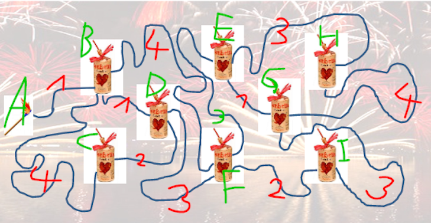
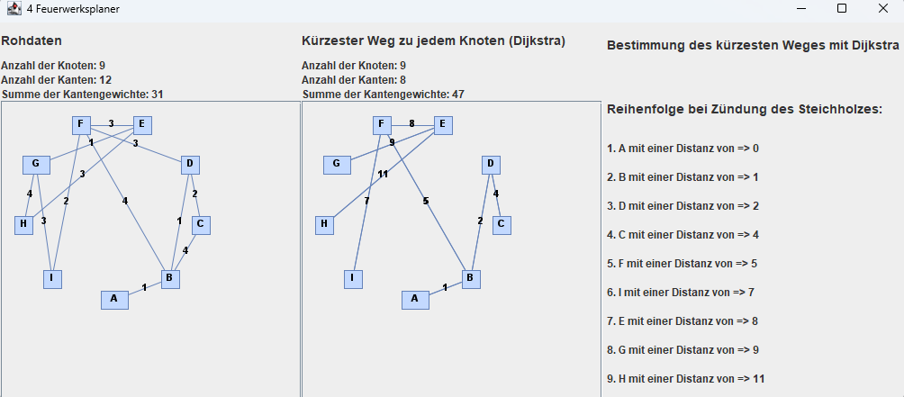

# Problem 4 - "Historische Funde"

Beim Ausheben der Wege während des Straßenbaus wurde ein antiker Feuerwerksplan
gefunden. Die Lage der pyrotechnischen Effekte und die Zündschnüre sind noch sehr gut
zu erkennen.

Wie aber ist die Choreographie des Feuerwerks? In welcher Reihenfolge zünden die
Bomben? Können Sie den Bürgern der Graphschaft Schilda helfen? (Unter der Annahme,
dass die Zündschnur immer mit gleichbleibender Geschwindigkeit abbrennt...)

## Modellierung des Problems

Das Problem lässt sich als Graphenmodell mit ungerichteten Kanten darstellen. Das Steichholz und die Feuerwerkskörper sind die Knoten, die Zündschnüre sind die Kanten. Die Kosten der Kanten sind die Länge der Zündschnüre.

Es wird die korrekte Reihenfolge gesucht, in der die Feuerwerkskörper gezündet werden wenn das Streichholz den ersten Feuerwerkskörper zündet.

Um den Graph zu modellieren werden die Java-Bibliotheken `JGraphT` und `JGraphX` verwendet. Mit `JGraphT` wird der Graph als Datenstruktur modelliert. Mit `JGraphX` wird der Graph als Grafik dargestellt und auf dem Bildschirm dargestellt.

## Die Eingabe

Um das Bild der Aufgabenstellung in konkrete Daten zu übersetzen, wurden hier Schätzungen der Länge der Zündschnüre vorgenommen und in einer Grafik dargestellt. Die Knoten wurden mit Buchstaben von A - I beschriftet.

Die Eingabe besteht aus einem Graphen, der aus Kanten und Knoten besteht. Diese werden aus einer `.txt` Datei gelesen und in eine Instanz der Klasse `AdjazenzMatrix.java` geladen. Diese Instanz dient als Basis für die Berechnung des minimalen Spannbaums.



```js
// code/data/problem4.txt
  A B C D E F G H I
A 0
B 1 0
C 0 4 0
D 0 1 2 0
E 0 0 0 0 0
F 0 4 0 3 3 0
G 0 0 0 0 1 0 0
H 0 0 0 0 3 0 4 0
I 0 0 0 0 0 2 3 0 0
```

## Die Ausgabe

Die Ausgabe wird als Graph in einem Fenster dargestellt und in die Datei `4 Feuerwerksplaner.txt` geschrieben. Das Fenster besteht aus drei Teilen. Auf der linken Seite wird der Eingabegraph dargestellt. In der Mitte wird der berechnete Graph dargestellt mit dem kürzesten Weg von A zu jedem anderen Knoten. Die Gewichte der Kanten zu den jeweiligen Knoten stellen die minimalen Gesamtkosten zum jeweiligen Knoten. Im rechten Teil wird eine Liste der Knoten dargestellt, in der die Knoten in der Reihenfolge aufgelistet sind, in der sie gezündet werden.

Ein korrekte Ausgabe erfüllt folgende Eigenschaften:

- Die Kantengewichte müssen die minimalen Gesamtkosten zum jeweiligen Knoten sein.

- Alle Knoten müssen über Kanten erreichbar sein.

- Der Graph muss zusammenhängend und zyklusfrei sein.

- Die Kanten müssen ungerichtet sein.

- Alle Knoten des Eingabe-Graphen müssen im Ausgabe-Graphen enthalten sein.



```js
// code/output/4 Feuerwerksplaner.txt
  A B C D E F G H I 
A 0 
B 1 0 
C 0 0 0 
D 0 2 4 0 
E 0 0 0 0 0 
F 0 5 0 0 8 0 
G 0 0 0 0 9 0 0 
H 0 0 0 0 11 0 0 0 
I 0 0 0 0 0 7 0 0 0 
```

## Geeignete Algorithmen

Für dieses Problem eignen sich die Algorithmen Dijkstra, Bellman-Ford und A*. 

Der Bellman-Ford-Algorithmus ist ein dynamischer Algorithmus, der iterativ die Entfernungen von dem Startknoten zu allen anderen Knoten im Graphen aktualisiert, bis sie stabil geworden sind. Der Dijkstra-Algorithmus hingegen ist ein statischer Algorithmus, der alle Entfernungen auf einmal berechnet.

Der A* Algorithmus ist ein Best-First-Suchalgorithmus, der dazu verwendet wird, den kürzesten Pfad von einem Startknoten zu einem Zielknoten in einem Graphen zu finden. Der A*-Algorithmus verwendet dabei eine Heuristik, um zu entscheiden, welche Knoten als nächstes untersucht werden sollen. Diese Heuristik basiert auf einer Schätzung der Entfernung des Knotens vom Ziel und wird verwendet, um den Algorithmus dazu zu bringen, sich auf die Knoten zu konzentrieren, die wahrscheinlich zum Ziel führen.

## Die Laufzeit des Algorithmus

TODO

## Die Implementierung des Algorithmus

Zur Lösung des Problems wurde der Dijkstra-Algorithmus verwendet.  Der Dijkstra-Algorithmus ist ein Greedy-Algorithmus. 

Der Algorithmus verwendet dabei eine Prioritätswarteschlange, um die Knoten zu sortieren, die als nächstes untersucht werden sollen. Die Prioritätswarteschlange wird mit den Knoten initialisiert, die direkt mit dem Startknoten verbunden sind. Die Knoten werden dann in der Prioritätswarteschlange nach ihrer Entfernung vom Startknoten sortiert. Der Algorithmus wählt dann den Knoten mit der geringsten Entfernung aus der Prioritätswarteschlange aus und aktualisiert die Entfernungen aller Knoten, die mit diesem Knoten verbunden sind. 

Dadurch bekommt jeder Knoten einen Wert, der die Entfernung vom Startknoten angibt. Der Algorithmus wird dann wiederholt, bis alle Knoten in der Prioritätswarteschlange untersucht wurden.


```java
private int[][] dijkstra(AdjazenzMatrix input) {

  int[][] matrix = input.getMatrixCopy();
  char[] vertexLetters = input.getVertexLetters();

  // Generiere eine Liste aller Knoten
  for (int i = 0; i < matrix.length; i++)
    vertices.add(new Vertex(vertexLetters[i], 0));

  ArrayList<Edge> edges = getEdges(matrix, vertexLetters);

  // Initialisiere die Distanz im Startknoten mit 0 und in allen anderen Knoten
  // mit ∞.
  for (Vertex vertex : vertices) {
    vertex.setKey(Integer.MAX_VALUE);
    vertex.setPredecessor(null);
  }
  vertices.get(0).setKey(0);

  // Speichere alle Knoten in einer Prioritätswarteschlange queue
  PriorityQueue<Vertex> queue = new PriorityQueue<Vertex>(
      Comparator.comparingInt(Vertex::getKey));
  queue.addAll(vertices);

  // Solange es noch unbesuchte Knoten gibt, wähle darunter denjenigen mit
  // minimaler Distanz aus und
  while (!queue.isEmpty()) {
    // Nehme den Knoten mit dem kleinsten Wert aus der Warteschlange
    Vertex v = queue.poll();

    // 1. speichere, dass dieser Knoten schon besucht wurde
    v.setVisited(true);

    // 2. berechne für alle noch unbesuchten Nachbarknoten die Summe des jeweiligen
    // Kantengewichtes und der Distanz im aktuellen Knoten
    for (Vertex n : getNeighbors(v, vertices, edges)) {

      // 3. ist dieser Wert für einen Knoten kleiner als die
      // dort gespeicherte Distanz, aktualisiere sie und setze den aktuellen Knoten
      // als Vorgänger. (Dieser Schritt wird auch als Update bezeichnet. )
      int sum = v.getKey() + getWeightSum(v, n, edges);

      if (sum >= n.getKey())
        continue;

      n.setKey((int) sum);
      n.setPredecessor(v);
      // Aktualisiere die Prioritätswarteschlange
      queue.remove(n);
      queue.add(n);
    }
  }

  // Sortiere Knoten nach Distanz
  vertices.sort(Comparator.comparingInt(Vertex::getKey));

  // Erstelle eine neue Adjazenzmatrix, die den jeweils kürzesten Weg zu jedem
  // Knoten enthält
  int[][] matrix_output = new int[matrix.length][matrix.length];

  for (Vertex vertex : vertices) {
    if (vertex.getPredecessor() == null)
      continue;
    matrix_output[vertex.getPredecessor().getLetter() - 'A'][vertex.getLetter() - 'A'] = vertex.getKey();
    matrix_output[vertex.getLetter() - 'A'][vertex.getPredecessor().getLetter() - 'A'] = vertex.getKey();
  }

  return matrix_output;
}
```
