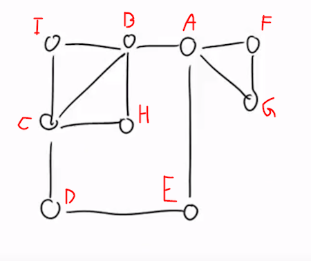
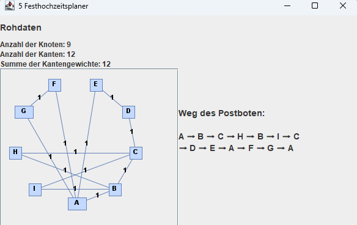

# Problem 5 - "Die Festhochzeit - das Verteilen der Einladungen"

Zum großen Hochzeitfest in Schilda sollen natürlich alle Ortsbewohner eingeladen werden.

Da in der letzten Zeit in Schilda viele neue Straßen gebaut worden waren, muss der Briefträger eine neue Route finden. Glücklicherweise haben alle Häuser ihre Briefkästen an die neuen Straßen gestellt, so dass der Briefträger nur noch den kürzesten Weg finden muss, der ausgehend von der Post durch alle Straßen und dann wieder zurück zur Post führt.

Hier sind Sie wieder gefragt:
Unterstützen Sie den Briefträger und entwerfen Sie die neue Route für den Briefträger. Den Stadtplan kennen Sie ja bereits, schließlich haben Sie die Straßen gebaut.

## Modellierung des Problems

Das Problem lässt sich Graphenmodell mit ungerichteten und ungewichteten Kanten darstellen. Für die Eingabe wurde ein eigener Graph erstellt, die Kreise symbolisieren die Knoten und die Verbindungen dazwischen die Kanten. (Der Graph muss ein Eulerkreis sein, das bedeutet er darf nur Knoten mit gerader Kantenanzahl besitzen. => nochmal nachlesen)

Es wird nach einem Weg auf dem Graphen gesucht, der jede Kante nur einmal abläuft und bei dem der Startknoten gleich dem Endknoten ist.

Um den Ausgabegraph zu modellieren, wird an einem beliebigen Startknoten angefangen und von diesem aus alle Knoten abgelaufen bis ein bereits bekannter Knoten wieder getroffen wird, der keine freien Nachbarn mehr besitzt. Wenn es noch freie Knoten gibt, geht man den Weg wieder zurück, bis man einen Knoten erreicht der noch freie Nachbarn besitzt. Dieser Vorgang wird wiederholt, bis es keinen Knoten mit unbesuchten Nachbarn mehr gibt.

Um den Graph zu modellieren werden die Java-Bibliotheken `JGraphT` und `JGraphX` verwendet. Mit `JGraphT` wird der Graph als Datenstruktur modelliert. Mit `JGraphX` wird der Graph als Grafik dargestellt und auf dem Bildschirm dargestellt.

## Die Eingabe

Die Eingabe besteht aus einem Graphen, der aus Kanten und Knoten besteht. Diese werden aus einer `.txt` Datei gelesen und in eine Instanz der Klasse `AdjazenzMatrix.java` geladen. Diese Instanz dient als Basis für die Berechnung einer geschlossenen Eulertour.

Das Bild wurde passend zur Aufgabenstellung selbst gezeichnet und mit den Buchstaben von A bis I beschriftet und daraus wurde die Datei `problem5.txt` erstellt.



```js
// code/data/problem5.txt
  A B C D E F G H I
A 0
B 1 0
C 0 1 0
D 0 0 1 0
E 1 0 0 1 0
F 1 0 0 0 0 0
G 1 0 0 0 0 1 0
H 0 1 1 0 0 0 0 0
I 0 1 1 0 0 0 0 0 0
```

## Die Ausgabe

Die Ausgabe wird (als Graph) Reihenfolge von Knoten in einem Fenster dargestellt und in die Datei `5 Festhochzeitsplaner` geschrieben. Das Fenster besteht aus zwei Hälften. Auf der linken Seite wird der Eingabegraph dargestellt. Auf der rechten Seite wird der berechnete (Graph) Weg dargestellt.

Eine korrekte Ausgabe erfüllt folgende Eigenschaften:

- Alle Kanten müssen genau einmal enthalten sein

- Der Endknoten muss gleich dem Startknoten sein

- Der Graph muss zusammenhängend sein

- Bei der Ausgabe Reihenfolge müssen die folgenden Knoten immer Nachbarknoten des vorherigen sein

- Alle Knoten des Eingabe-Graphen müssen im Ausgabe-Graphen enthalten sein.



```js
// code/output/5 Festhochzeitsplaner.txt
[A, B, C, H, B, I, C, D, E, A, F, G, A]
```

## Geeignete Algorithmen

Es gibt verschiedene Algorithmen, die verwendet werden können, um eine geschlossenen Eulertour eines ungerichteten und ungewichteten Graphen zu berechnen. Einige dieser Algorithmen sind:

### Algorithmus von Hierholzer

Dieser Algorithmus basiert auf der Tatsache, dass in einem ungerichteten und ungewichteten Graphen, mit Knoten, die alle eine gerade Kantenanzahl besitzen eine geschlossene Eulertour existiert. Der Algorithmus startet an einem beliebigen Knoten und folgt dann den Kanten, bis er wieder zum Ausgangsknoten zurückkehrt. Wenn es am aktuellen Knoten keine freien Kanten gibt, geht der Algorithmus wieder zu einem Knoten mit freien Kanten zurück. Der Algorithmus endet, wenn alle Kanten besucht wurden und man wieder am Ausgangsknoten angekommen ist.

### Algorithmus von Fleury

Dieser Algorithmus basiert ebenfalls auf der Tatsache, dass in einem ungerichteten und ungewichteten Graphen, mit Knoten, die alle eine gerade Kantenanzahl besitzen eine geschlossene Eulertour existiert. Der Algorithmus startet ebenfalls an einem beliebigen Knoten, der keine Brückenkanten besitzt und fügt dann immer eine weitere Kante hinzu, die den aktuellen Knoten mit einem anderen Knoten verbindet. Wenn es mehrere mögliche freie Kanten gibt, wird zuerst die Kante gewählt, die keine Brückenkante ist. Wenn es am aktuellen Knoten keine freien Kanten gibt, geht der Algorithmus wieder zu einem Knoten mit freien Kanten zurück. Dieser Prozess wird wiederholt, bis alle Kanten besucht wurden.

## Die Laufzeit des Algorithmus

Laufzeit Problem 5 = O(V^2)

Die Funktion `mirrorMatrix()` hat eine Laufzeit von O(V^2), da zwei for-Schleifen verschachtelt sind, die jeweils eine Laufzeit von O(V) beistzen.

Die Funktion `isEulerGraph` hat eine Laufzeit von O(V^2), da zwei for-Schleifen verschachtelt sind, die jeweils eine Laufzeit von O(V) beistzen.

Die Laufzeit der Funktion `hierholzerEulerTour()` hängt von der Anzahl der Knoten (V) im Graph ab. Die Laufzeit der Schleife, die die Nachbarn eines Knotens durchläuft, beträgt O(V^2), da jeder Knoten mit jedem anderen Knoten verglichen werden Kann. Die Laufzeit des Stacks beträgt normal O(1). Daraus ergibt sich eine Laufzeit von O(V^2)

Die while-Schleife hat eine Laufzeit von O(V), da alle Knoten in der Prioritätswarteschlange einmal durchlaufen werden können. Innerhalb der while-Schleife wird ein Element aus der Warteschlange genommen O(log(V)) und die Funktion `getNeighbors()` aufgerufen.

Daraus resultiert eine Laufzeit von O(V^2) + O(V^2) + O(V^2).
Umgeformt ergibt sich eine Laufzeit von 3 * O(V^2).

## Die Implementierung des Algorithmus

Zur Lösung des Problems wurde der Algorithmus von Hierholzer implementiert. Der Algorithmus von Hierholzer basiert darauf, dass sich ein eulerscher Graph in paarweise kantendisjunkte Kreise zerlegen lässt. Als Datenstruktur wurde ein Stack verwendet, der Instanzen der Klasse Character beinhaltet, die den Knoten des Graphen entsprechen, sowie eine ArrayList zum Speichern der Eulertour:

Zuerst wir die Matrix des Graphen der Funktion `mirrorMatrix` gespiegelt, damit die Kanten in beide Richtungen verfügbar sind.

Im nächsten Schritt wird mit der Funktion `isEulerGraph` überprüft, ob der Graph ein Eulergraph ist.

Wenn dies der Fall ist, wird die Funktion `hierholzerEulerTour()` aufgerufen, die die Eulertour berechnet. Die Funktion nimmt die Matrix des Graphen und ein Array mit den Buchstaben der Knoten entgegen. Der erste Knoten wird als Startpunkt gewählt und auf den Stack gelegt. Solange der Stack nicht leer ist, wird der oberste Knoten des Stacks betrachtet. Der Algorithmus durchläuft dann alle Nachbarn des aktuellen Knotens und prüft, ob eine Kante zwischen ihnen besteht. Falls ja, wird der Nachbar auf den Stack gelegt und die Kante entfernt. Falls kein weiterer Nachbar gefunden wurde, wird der aktuelle Knoten vom Stack entfernt und dem Pfad hinzugefügt. Am Ende wird der Pfad zurückgegeben.
