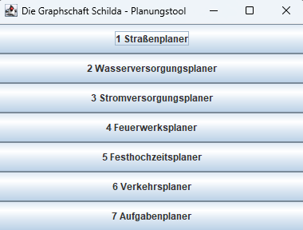

# Die Graphschaft Schilda

## Abstract

Diese Website ist die Dokumentation des Projektes "Graphschaft Schilda" für das Modul Programmiertechnik III an der TH Aschaffenburg.

Die Graphschaft Schilda ist ein beschauliches Örtchen irgendwo im Nichts.
Lange Zeit blieb diese Graphschaft unbehelligt vom Fortschritt, nichts tat sich in dem  Örtchen. Eines Tages jedoch machte sich dort plötzlich das Gerücht breit, dass fernab der Graphschaft intelligente Menschen leben, die (fast) alle Probleme der Welt mit mächtigen Algorithmen lösen könnten. Die Bürger der Graphschaft machten sich also auf den Weg um diese intelligenten Menschen mit der Lösung ihrer Probleme zu beauftragen....

### Art der Dokumentation

Die Dokumentation des Projekts ist auf der Website [schilda.node5.de](https://schilda.node5.de/) zu finden. Alternativ wird automatisiert aus den Markdown-Dateien eine PDF-Dokumentation erstellt, die über [diesen Link](https://github.com/thieleju/GraphschaftSchilda/raw/gh-pages/Dokumentation.pdf) herunter geladen werden kann.

## Aufgabenstellung

Entwickeln Sie ein Planungstool, dass der Graphschaft Schilda bei der Lösung ihrer Probleme hilft.  

1. Analysieren Sie jedes der Probleme: Welche Daten sollen verarbeitet werden? Was sind die Eingaben? Was die Ausgaben? Welcher Algorithmus eignet sich? Welche Datenstruktur eignet sich?
2. Implementieren Sie den Algorithmus (in Java), so dass bei Eingabe der entsprechenden Daten die gewünschte Ausgabe berechnet und ausgegeben wird. 
3. Geben Sie für jeden implementierten Algorithmus die Laufzeit an. Da Sie sich nun schon so viel Mühe mit dem Tool geben, wollen Sie das Tool natürlich auch an andere Gemeinden verkaufen. Die Eingaben sollen dafür generisch, d.h., für neue Orte, Feiern und Planungen anpassbar sein. Sie können diese Aufgabe ein 2er oder 3er Teams lösen. Bitte geben Sie dann die Arbeitsteilung im Dokument mit an. Die 15minütige Einzelprüfung wird auf die Projektaufgabe eingehen.

## Rahmenbedingungen

### Eingabe

Alle Algorithmen benötigen **einen Graph als Eingabe** und liefern **einen Graph als Ausgabe**.
Die Testgraphen werden je nach Art des Graphen folgende Form haben:

1. ungerichteter und ungewichteter Graph
2. ungerichteter und gewichteter Graph
3. gerichteter und ungewichteter Graph
4. gerichteter und gewichteter Graph

Alle Graphen werden als einfache Textdateien gegeben. Die erste Zeile beginnt mit zwei Leerzeichen, gefolgt von den **Namen der Knoten**, jeweils getrennt mit einem Leerzeichen.
Alle weiteren Zeilen starten mit einem **Knotennamen, gefolgt von einer Folge von Zahlen**, jeweils **getrennt durch ein Leerzeichen**.
Für ungerichtete Graphen werden jeweils nur die Werte unterhalb der Diagonalen angegeben.

**Wichtig:** Um neue Daten für die Eingabe zu verwenden, muss der Inhalt der txt-Dateien im Ordner "code/data/problemX.txt" ersetzt werden.

### Ausgabe

Die Ausgabe erfolgt in derselben Form wie die Eingabe.

### Abgabe Projekt

Das Projekt ist als PDF-Datei mit folgender Benennung "PT3-2022-FelixMöhler-JulianThiele.pdf" bis zum 20.01.2023 abzugeben.

## Planungstool Aufbau

In den folgenden Abschnitten wird der Aufbau des Planungstools beschrieben.

### Ordnerstruktur des Projektes

```js
GraphschafSchilda/
├─ code/
│  ├─ data/
│  │  └─ Eingabe txt-Dateien
│  ├─ output/
│  │  └─ Ausgabe txt-Dateien
│  ├─ old/
│  │  └─ Frühere Versionen der Algorithmen
│  ├─ utils/
│  │  ├─ AdjazentMatrix.java
│  │  ├─ BasicWindow.java
│  │  ├─ Edge.java
│  │  ├─ FileHandler.java
│  │  ├─ JGraphPanel.java
│  │  └─ Vertex.java
│  ├─ Main.java
│  ├─ Problem1.java
│  ├─ Problem2.java
│  ├─ Problem3.java
│  ├─ Problem4.java
│  ├─ Problem5.java
│  ├─ Problem6.java
│  └─ Problem7.java
├─ documentation/
│  └─ docs/
└─ libs/
```

### Das Interface

Sobald das Programm startet, öffnet sich ein Fenster mit einem Menü für die Auswahl der verschiedenen Probleme. Wenn ein Knopf gedrückt wird, öffnet sich ein neues Fenster mit dem entsprechenden Problem. 



### Die Aufgaben

Jedes Problem besitzt eine eigene Klasse `ProblemX.java`, die sich im Ordner `code` befinden. 

Der Ordner `code/utils` enthält die Klassen:

- `AdjazenzMatrix.java`: Speichert eine `int[][]` Matrix, `char[]` Buchstaben-Array und ob es sich um einen gerichteten oder ungerichteten Graphen handelt.

- `FileHandler.java`: Stellt Methoden zum Einlesen und Schreiben von Dateien bereit. Die Laufzeit um eine Datei einzulesen ist `O(n)` mit n = Anzahl der Zeichen in der Datei. Die Laufzeit des Schreibens ist `O(V^2)` mit V = Anzahl der Knoten des Graphen.

- `Vertex.java`: Speichert einen Buchstaben, einen Vertex-Vorgänger, einen 'key' und eine Option ob der Vertex bereits besucht wurde.

- `Edge.java`: Speichert zwei Buchstaben für den Start- und Endknoten der Kante und ein Gewicht.

- `JGraphPanel.java`: Eine Klasse, die ein `JPanel` erweitert und mit Hilfe der [mxgraph](https://jgraph.github.io/mxgraph/) und [jgrapht](https://jgrapht.org/) Bibliotheken einen Graphen zeichnet.

- `BasicWindow.java`: Eine Klasse, die ein `JFrame` erweitert und als Grundlage für die Fenster der einzelnen Probleme dient.

#### Die Eingabe

Die Eingabedateien befinden sich in dem Ordner `data` und folgen dem Namensschema `problemX.txt`. Die Dateien werden mit der Klasse `FileHandler.java` eingelesen und in einer Instanz der Klasse `AdjazenzMatrix.java` gespeichert. 

```js
Ungerichteter Graph      Gerichteter Graph
  A B C ...                A B C ...
A 0                      A 0 0 1
B 1 0                    B 0 0 1
C 2 3 0                  C 1 0 0
...                      ...
```

#### Die Ausgabe

Die Ausgabedateien befinden sich in dem Ordner `output` und werden automatisch generiert oder überschrieben sobald ein Punkt aus dem Menü ausgewählt wird.

Beim Betätigen eines Menübuttons wird die Ein- und Ausgabe graphisch dargestellt und zusätzlich in der Konsole ausgegeben.

In der Ausgabedatei werden die Graphen in einer Adjazenzmatrix gespeichert, die dem Schema der Eingabedatei entspricht. 

## Das Team

Felix Möhler - [GitHub](https://github.com/flexx7)
- Aufgabenteilung: Dokumentation und Code für Problem 2, 5, 6 und 

Julian Thiele - [GitHub](https://github.com/thieleju)
- Aufgabenteilung: Dokumentation und Code für Problem 1, 3, 4, 6 und 7

## Auftraggeber

Prof. Barbara Sprick - Professorin für Praktische Informatik bei TH Aschaffenburg